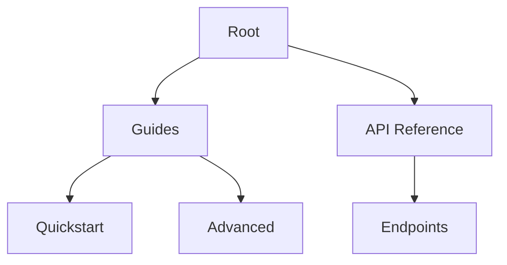

## Overview

Lpk provides a flexible platform for organizing your project documentation. You create spaces to group related docs, define hierarchies for navigation, control access with permissions, and customize appearances to match your brand. These core concepts form the foundation for efficient documentation management.

<Columns cols={2}>
  <Card title="Documentation Spaces" icon="folder" href="#documentation-spaces">
    Group related documentation into isolated spaces.
  </Card>
  <Card title="Project Structure" icon="layers" href="#project-structure">
    Organize files with intuitive hierarchies.
  </Card>
  <Card title="Permissions" icon="shield" href="#permissions">
    Control who views and edits your docs.
  </Card>
  <Card title="Customization" icon="palette" href="#customization">
    Tailor themes and layouts to your needs.
  </Card>
</Columns>

## Documentation Spaces

Documentation spaces act as containers for your projects. You create a space for each major initiative, such as API docs or user guides. Each space maintains its own settings, members, and content.

<Callout kind="info">
  Spaces isolate content, preventing cross-project clutter.
</Callout>

Use the API to manage spaces programmatically.

<CodeGroup tabs="JavaScript,Python">
  ```javascript
  // Create a new space
  const response = await fetch('https://api.example.com/v1/spaces', {
    method: 'POST',
    headers: { 'Authorization': 'Bearer YOUR_API_KEY' },
    body: JSON.stringify({
      name: 'My Project Docs',
      description: 'Documentation for Lpk project'
    })
  });
  ```
  ```python
  import requests

  response = requests.post(
      'https://api.example.com/v1/spaces',
      headers={'Authorization': 'Bearer YOUR_API_KEY'},
      json={
          'name': 'My Project Docs',
          'description': 'Documentation for Lpk project'
      }
  )
  ```
</CodeGroup>

## Project Structure and Hierarchy

You organize documentation using a folder-based hierarchy. Files at the root appear in the main navigation, while subfolders create nested menus. This mirrors your project's logical structure.



<Steps>
  <Step title="Create Folders" icon="folder">
    Use the dashboard to add folders like `guides/` and `api/`.
  </Step>
  <Step title="Add Files" icon="file-text">
    Upload MDX files to populate your structure.
  </Step>
  <Step title="Reorder" icon="move">
    Drag and drop to adjust the navigation order.
  </Step>
</Steps>

## Permissions and Access Control

Lpk uses role-based access control (RBAC). You assign roles like Viewer, Editor, or Admin to users or teams. Permissions propagate down the hierarchy unless overridden.

<Tabs>
  <Tab title="Viewer" icon="eye">
    Read-only access to published docs.
  </Tab>
  <Tab title="Editor" icon="edit-3">
    Edit content and structure, but cannot manage members.
  </Tab>
  <Tab title="Admin" icon="shield-check">
    Full control including billing and invites.
  </Tab>
</Tabs>

<ParamField path="spaceId" param-type="string" required="true">
  Target space identifier.
</ParamField>

<ParamField path="role" param-type="string" required="true">
  Role to assign: `viewer`, `editor`, or `admin`.
</ParamField>

## Customization Options

Tailor your docs with themes, logos, and custom CSS. You configure these at the space level to ensure consistency.

<Expandable title="Advanced Theme Config" default-open="false">
  Override defaults with a `theme.yaml` file.

  ```yaml
  primaryColor: '#3B82F6'
  logoUrl: 'https://example.com/logo.png'
  fontFamily: 'Inter, sans-serif'
  customCss: |
    .navbar { background: linear-gradient(90deg, #3B82F6, #1D4ED8); }
  ```
</Expandable>

<Callout kind="tip">
  Test customizations in preview mode before publishing.
</Callout>

## Best Practices

Combine these concepts for scalable docs:

- Start with one space per project.
- Use shallow hierarchies (`<3` levels deep).
- Audit permissions quarterly.
- Version custom themes in Git.

<Columns cols={2}>
  <Card title="Quickstart" icon="zap" href="/quickstart">
    Set up your first space.
  </Card>
  <Card title="Permissions Guide" icon="key" href="/authentication">
    Deep dive into access controls.
  </Card>
</Columns>