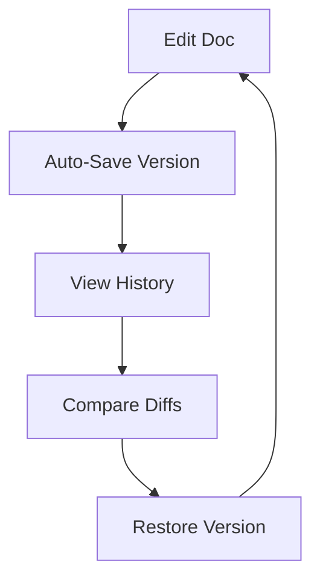

## Overview

Lpk provides powerful tools to streamline your project documentation. You organize content into structured spaces, collaborate with teams in real-time, track changes with version history, and quickly find information using advanced search. These features help you maintain clear, up-to-date docs without complexity.

## Key Features

Discover Lpk's core capabilities through these highlighted features.

<Columns cols={2}>
  <Card title="Document Organization" icon="folder" href="#document-organization">
    Structure your docs with folders, tags, and hierarchies for easy navigation.
  </Card>
  <Card title="Collaboration Tools" icon="users" href="#collaboration">
    Share docs securely and edit together with role-based permissions.
  </Card>
  <Card title="Version History" icon="git-branch" href="#version-history">
    Track every change with diffs, restores, and audit logs.
  </Card>
  <Card title="Search & Filtering" icon="search" href="#search">
    Find content instantly with full-text search and advanced filters.
  </Card>
</Columns>

## Document Organization Tools

Organize your documentation efficiently using Lpk's folder system and tagging.

<Steps>
  <Step title="Create Folders" icon="folder-plus">
    Navigate to your workspace and select `New Folder`. Name it descriptively, like `API Reference`.
  </Step>
  <Step title="Add Tags" icon="tag">
    Open a document, click `Tags`, and apply labels such as `internal` or `public`.
  </Step>
  <Step title="Nest Content" icon="layers">
    Drag documents into folders to build hierarchies. Access via sidebar navigation.
  </Step>
</Steps>

<Callout kind="tip">
  Use consistent naming conventions like `v1.0-endpoints` for folders to speed up location.
</Callout>

## Collaboration and Sharing Options

Invite team members and control access levels.

<Tabs>
  <Tab title="Internal Team" icon="users">
    Generate share links with view-only or edit permissions. Set expiration dates for temporary access.

    ```javascript
    // Example API call to create a share
    const response = await fetch('https://api.example.com/v1/shares', {
      method: 'POST',
      headers: { 'Authorization': 'Bearer YOUR_TOKEN' },
      body: JSON.stringify({
        docId: 'doc_123',
        permissions: 'edit',
        expiresAt: '2024-12-31'
      })
    });
    ```
  </Tab>
  <Tab title="Public Sharing" icon="globe">
    Publish docs publicly or embed them. Track views with analytics.

    ```javascript
    // Publish a doc publicly
    await fetch('https://api.example.com/v1/docs/doc_123/publish', {
      method: 'POST',
      headers: { 'Authorization': 'Bearer YOUR_TOKEN' }
    });
    ```
  </Tab>
</Tabs>

## Version History Tracking

Lpk automatically saves versions on every edit. View diffs and rollback as needed.



<Expandable title="Advanced Version Controls" default-open="false">
  Use the API to fetch history programmatically.

  <CodeGroup tabs="JavaScript,Python">
  ````javascript
  const history = await fetch('https://api.example.com/v1/docs/doc_123/history', {
    headers: { 'Authorization': 'Bearer YOUR_TOKEN' }
  }).then(res => res.json());
  ````
  ````python
  import requests
  response = requests.get(
      'https://api.example.com/v1/docs/doc_123/history',
      headers={'Authorization': 'Bearer YOUR_TOKEN'}
  ).json()
  ````
  </CodeGroup>
</Expandable>

## Search and Filtering Functions

Search across all docs with filters for tags, authors, and dates.

| Filter Type | Example Query | Matches |
|-------------|---------------|---------|
| Full-Text   | `API endpoint` | All docs containing phrase |
| Tag         | `tag:internal` | Internal-only content |
| Date Range  | `date:>2024-01-01` | Recent updates |
| Author      | `author:john` | John's contributions |

Integrate search via API:

<CodeGroup>
````javascript
// Search docs
const results = await fetch('https://api.example.com/v1/search?q=API&tags=public', {
  headers: { 'Authorization': 'Bearer YOUR_TOKEN' }
}).then(res => res.json());
````
````python
import requests
results = requests.get(
    'https://api.example.com/v1/search?q=API&tags=public',
    headers={'Authorization': 'Bearer YOUR_TOKEN'}
).json()
````
</CodeGroup>

<Callout kind="info">
  Combine filters like `q=setup tags:guide date:>2024` for precise results. Start exploring these features to boost your team's productivity.
</Callout>